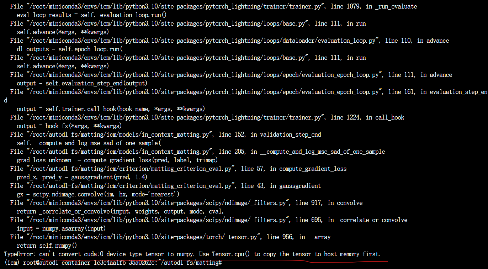
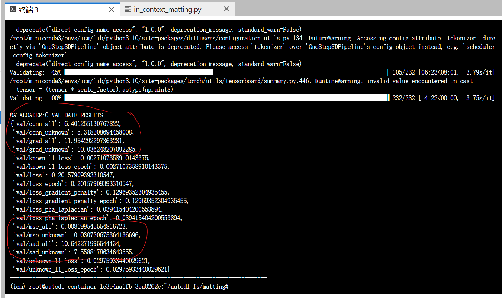
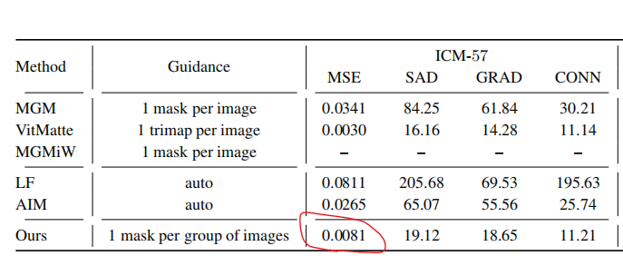
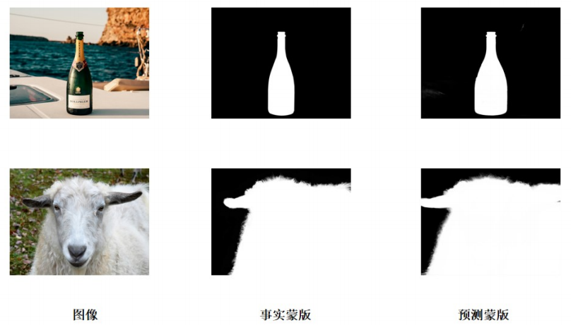
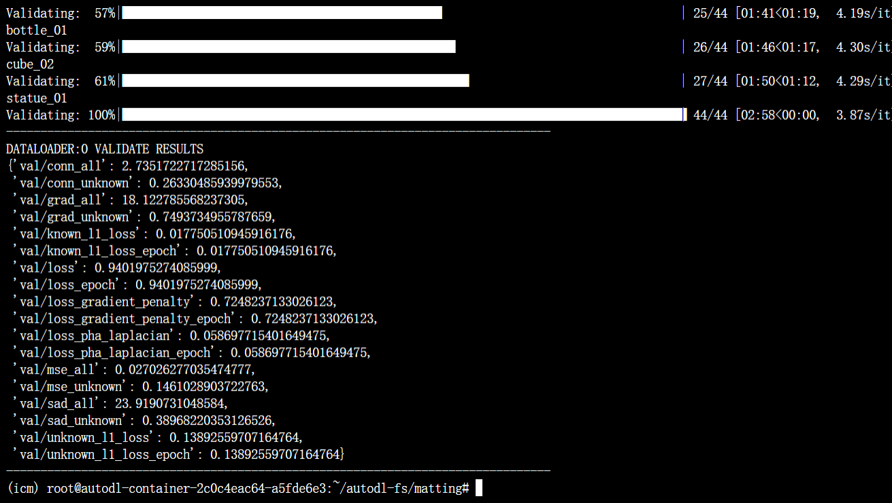
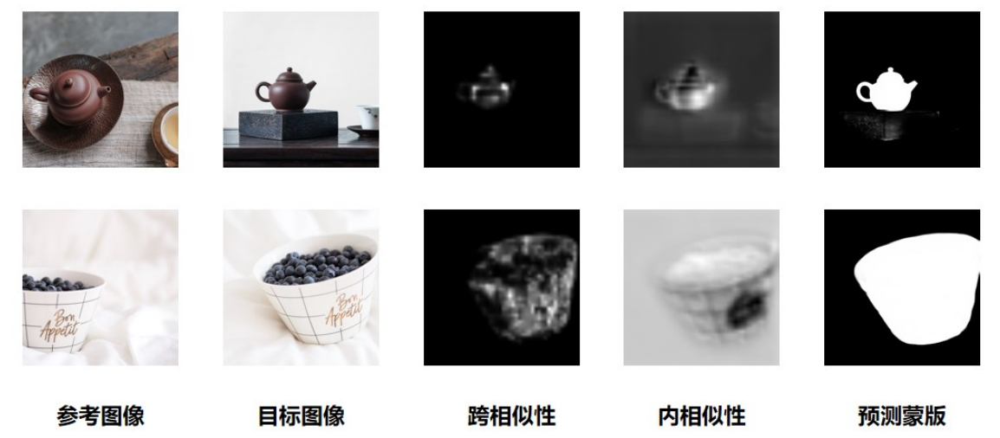
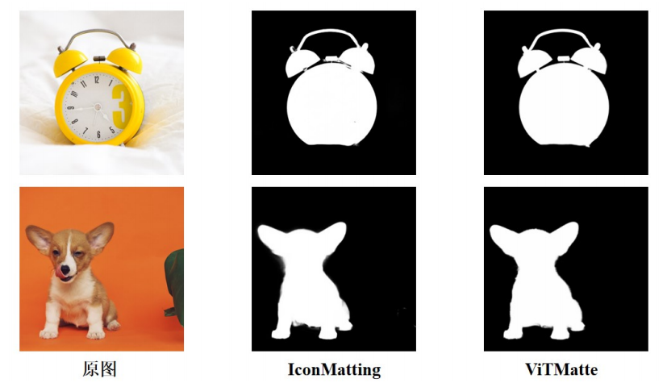
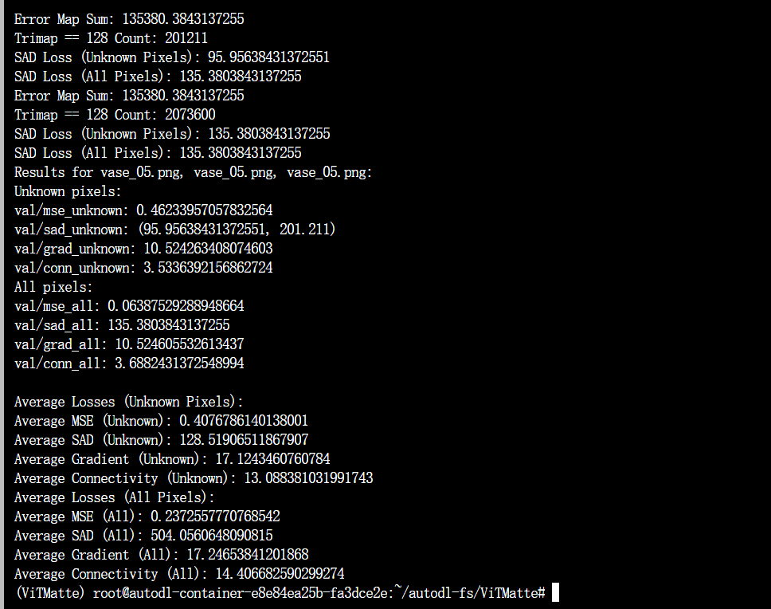
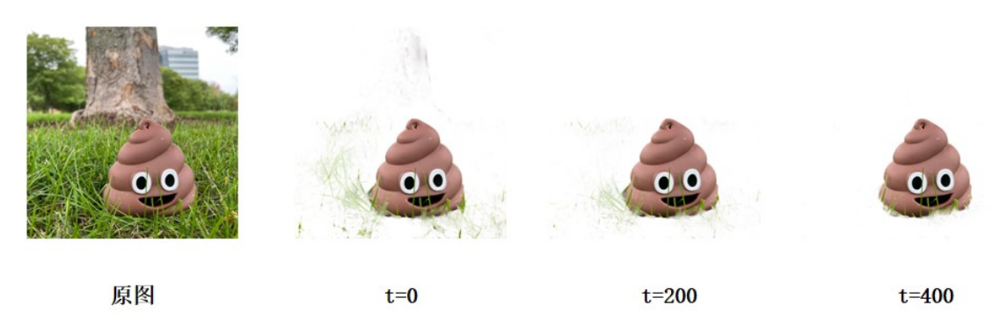

# 评估
## 在in_context_matting. py改几行代码
### import中添加
`from icm.criterion.matting_criterion_eval import compute_mse_loss_torch, compute_sad_loss_torch, compute_gradient_loss, compute_connectivity_error`

### 修改__compute_and_log_mse_sad_of_one_sample
本来的代码就计算了两个指标，加上另两个就可.
```python
def __compute_and_log_mse_sad_of_one_sample(self, pred, label, trimap, prefix="val"):

        step = 0.1

        # compute loss for unknown pixels
        mse_loss_unknown_ = compute_mse_loss_torch(pred, label, trimap)
        sad_loss_unknown_ = compute_sad_loss_torch(pred, label, trimap)
        grad_loss_unknown_ = compute_gradient_loss(pred, label, trimap)
        conn_loss_unknown_ = compute_connectivity_error(pred, label, trimap, step)
        # compute loss for all pixels
        trimap = torch.ones_like(label)*128
        mse_loss_all_ = compute_mse_loss_torch(pred, label, trimap)
        sad_loss_all_ = compute_sad_loss_torch(pred, label, trimap)
        grad_loss_all_ = compute_gradient_loss(pred, label, trimap)
        conn_loss_all_ = compute_connectivity_error(pred, label, trimap, step)
        # log
        metrics_unknown = {f'{prefix}/mse_unknown': mse_loss_unknown_,
                           f'{prefix}/sad_unknown': sad_loss_unknown_,
                           f'{prefix}/grad_unknown': grad_loss_unknown_,
                           f'{prefix}/conn_unknown': conn_loss_unknown_,     
                        }

        metrics_all = {f'{prefix}/mse_all': mse_loss_all_,
                       f'{prefix}/sad_all': sad_loss_all_,
                       f'{prefix}/grad_all': grad_loss_all_,
                       f'{prefix}/conn_all': conn_loss_all_,    
                    }

        self.log_dict(metrics_unknown, on_step=False,
                      on_epoch=True, prog_bar=False, sync_dist=True)
        self.log_dict(metrics_all, on_step=False,
                      on_epoch=True, prog_bar=False, sync_dist=True)
```
#### 参数step
connectivity error有一个参数step，设置为0.1，搜索引擎直接搜了 `compute_connectivity_error` 这个函数，看到别人的step也是设置为0.1.
[utils/evaluate.py · shi-labs/Matting-Anything at main (huggingface.co)](https://huggingface.co/spaces/shi-labs/Matting-Anything/blob/main/utils/evaluate.py)

####  self. log_dict 
`self. log_dict (metrics_unknown, on_step=False, on_epoch=True, prog_bar=False, sync_dist=True)`

里面的参数 `on_epoch=True` 其实就是每轮结束再log的意思，大概会取每一步的平均值。

>- **on_step**[](https://lightning.ai/docs/pytorch/stable/api/lightning.pytorch.core.LightningModule.html#lightning.pytorch.core.LightningModule.log_dict.params.on_step) ([`Optional`]( https://docs.python.org/3/library/typing.html#typing.Optional "(in Python v3.12)")[[`bool`]( https://docs.python.org/3/library/functions.html#bool "(in Python v3.12)")]) – if `True` logs at this step. `None` auto-logs for training_step but not validation/test_step. The default value is determined by the hook. See [Automatic Logging](https://lightning.ai/docs/pytorch/stable/extensions/logging.html#automatic-logging) for details.
>- **on_epoch**[](https://lightning.ai/docs/pytorch/stable/api/lightning.pytorch.core.LightningModule.html#lightning.pytorch.core.LightningModule.log_dict.params.on_epoch) ([`Optional`]( https://docs.python.org/3/library/typing.html#typing.Optional " (in Python v3.12)")[[`bool`]( https://docs.python.org/3/library/functions.html#bool " (in Python v3.12)")]) – if `True` logs epoch accumulated metrics. `None` auto-logs for val/test step but not `training_step`. The default value is determined by the hook. See [Automatic Logging](https://lightning.ai/docs/pytorch/stable/extensions/logging.html#automatic-logging) for details.

### 让validation_step_end里的注释有效
 `validation_step_end` 中原来就有这行，去掉前面的#：
```python
self.__compute_and_log_mse_sad_of_one_sample(pred, label, trimap, prefix="val")
```  

## 修改matting_criterion_eval. py以免报错
在 `compute_gradient_loss` 和 `compute_connectivity_error` 里，开头几行改为
```python
pred = pred.cpu().numpy() / 255.0
target = target.cpu().numpy() / 255.0
trimap = trimap.cpu().numpy()
```
不然会报如下的错：


## ICM57评估结果


写为表格：

| MSE    | SAD   | GRAD  | CONN |
| ------ | ----- | ----- | ---- |
| 0.0082 | 10.64 | 11.95 | 6.40 |



最终评估的结果和论文里只有MSE是接近的，虽然也有模型改变了的的可能，~~但让我怀疑是不是哪没做对。~~
学长修改了训练集和测试集的比例，验证时会减小损失。
## 新数据集评估结果




| MSE    | SAD   | GRAD  | CONN |
| ------ | ----- | ----- | ---- |
| 0.0270 | 23.92 | 18.12 | 2.74 |
CONN 指标为 2.74，相较于之前的数据集，误差减小，模型在新数据集上表现出了更好的连续性。
CONN以外其他部分指标评估的准确性上有所下降，但模型在新数据集上仍展示了较为稳定的性能。

# 可视化相似性模块



茶壶是从俯视角度拍摄的，这导致由跨相似性模块映射到目标图像的茶壶缺少了底部的点。同样地，目标图像中的碗在左边缺失了一小部分。如果仅依赖跨相似性模块，由于参考前景和目标前景之间存在固有的视角和形状等差异，无法实现精确的一对一映射。这些差异导致了目标图像抠图区域内出现空洞和缺失。
自相似性模块通过分析目标图像内部的相似性，将互相似性模块中得到的指导图与多尺度自注意力图结合，从而填补跨相似性映射模块的不足，补全空洞。

# 与其他模型的对比


VitMatte是一种基于辅助输入 trimap 的抠图方法。该方法要求为每幅图像手动输入前景 trimap，这一操作虽然能确保高质量的抠图效果，但在处理大量图像时，手动输入的工作量显得相当繁琐。而与之相比，IconMatting 在处理同一组同类别前景的图片时，只需要一张 alpha matte 作为输入。这一显著差异使得在处理一组图片的情况下，ViTMatte 成为 IconMatting 的性能上限。

IconMatting 的性能虽然略逊于 ViTMatte，但差距并不明显。在批量处理同类别前景图的场景中，IconMatting 在减少辅助输入、提升处理效率的同时，还能保持较高的精度。因此，IconMatting 成为在效率和精度之间实现良好平衡的更优选择。



| MSE  | SAD    | GRAD  | CONN  |
| ---- | ------ | ----- | ----- |
| 0.24 | 504.06 | 17.28 | 14.41 |
用预训练模型的是ViTMatte-S。ViTMatte抠图效果肉眼看着很好，但是评估出来误差偏大 （尤其是SAD）。猜测是输出的预测alpha matte和真实alpha matte尺寸不一样。resize成统一尺寸后SAD还是大得离谱，不知道是不是预测alpha和真实alpha没有对齐，没学过，太多不懂了，于是没有做评估。
（真实alpha和ViTMatte输出的部分预测alpha尺寸对比：）

```
Trimap shape: (1080, 1619), Alpha shape: (1080, 1619), Result shape: (1440, 1080)
Trimap shape: (1620, 1080), Alpha shape: (1620, 1080), Result shape: (1620, 1080)
Trimap shape: (1080, 1440), Alpha shape: (1080, 1440), Result shape: (1440, 1440)
Trimap shape: (1620, 1080), Alpha shape: (1620, 1080), Result shape: (1440, 1440)
Trimap shape: (1080, 1620), Alpha shape: (1080, 1620), Result shape: (1440, 1440)
Trimap shape: (1620, 1080), Alpha shape: (1620, 1080), Result shape: (1440, 1440)
Trimap shape: (1080, 1511), Alpha shape: (1080, 1511), Result shape: (1280, 1280)
Trimap shape: (1080, 1624), Alpha shape: (1080, 1624), Result shape: (1440, 1440)
```
# Stable Diffusion 的时间步长消融实验

IconMatting 使用了 Stable Diffusion 作为特征提取器。经 Stable Diffusion 提取后，特征进入上下文相似性模块，该模块由跨相似性和内相似性子模块组成。在扩散过程中，选择时间步长 t 至关重要。通常，较小的 t 对应于更紧密地表示图像的特征，添加的噪声最少。而较大的 t 则捕捉到更抽象的语义特征。IconMatting需要兼顾这两点。

设置不同时间步长的评估结果：

| 时间步长 | MSE    | SAD   | GRAD  | CONN  |
|--------|--------|-------|-------|-------|
| 0      | 0.0110 | 13.68 | 13.08 | 8.16  |
| 100    | 0.0090 | 11.45 | 12.16 | 6.69  |
| 200    | 0.0082 | 10.64 | 11.95 | 6.40  |
| 300    | 0.0086 | 10.87 | 12.28 | 6.59  |
| 400    | 0.0096 | 11.60 | 12.88 | 7.02  |

t=200时，与模型表现最佳，与原论文结果一致。

