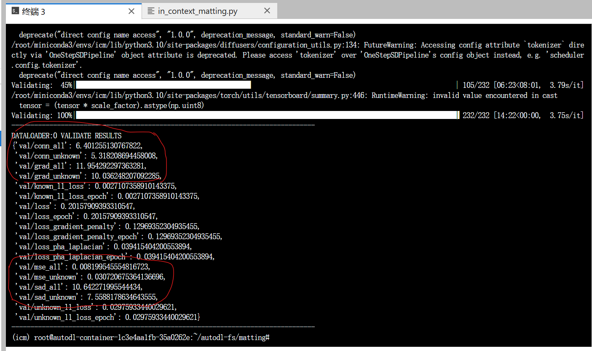

我做的只有：去掉注释，加上几行代码，调用一下已有的代码。不清楚这样对不对。
# 在in_context_matting. py改几行代码
## import中添加
`from icm.criterion.matting_criterion_eval import compute_mse_loss_torch, compute_sad_loss_torch, compute_gradient_loss, compute_connectivity_error`

## 修改__compute_and_log_mse_sad_of_one_sample
本来的代码就计算了两个指标，加上另两个就可.
```python
def __compute_and_log_mse_sad_of_one_sample(self, pred, label, trimap, prefix="val"):

        step = 0.1

        # compute loss for unknown pixels
        mse_loss_unknown_ = compute_mse_loss_torch(pred, label, trimap)
        sad_loss_unknown_ = compute_sad_loss_torch(pred, label, trimap)
        grad_loss_unknown_ = compute_gradient_loss(pred, label, trimap)
        conn_loss_unknown_ = compute_connectivity_error(pred, label, trimap, step)
        # compute loss for all pixels
        trimap = torch.ones_like(label)*128
        mse_loss_all_ = compute_mse_loss_torch(pred, label, trimap)
        sad_loss_all_ = compute_sad_loss_torch(pred, label, trimap)
        grad_loss_all_ = compute_gradient_loss(pred, label, trimap)
        conn_loss_all_ = compute_connectivity_error(pred, label, trimap, step)
        # log
        metrics_unknown = {f'{prefix}/mse_unknown': mse_loss_unknown_,
                           f'{prefix}/sad_unknown': sad_loss_unknown_,
                           f'{prefix}/grad_unknown': grad_loss_unknown_,
                           f'{prefix}/conn_unknown': conn_loss_unknown_,     
                        }

        metrics_all = {f'{prefix}/mse_all': mse_loss_all_,
                       f'{prefix}/sad_all': sad_loss_all_,
                       f'{prefix}/grad_all': grad_loss_all_,
                       f'{prefix}/conn_all': conn_loss_all_,    
                    }

        self.log_dict(metrics_unknown, on_step=False,
                      on_epoch=True, prog_bar=False, sync_dist=True)
        self.log_dict(metrics_all, on_step=False,
                      on_epoch=True, prog_bar=False, sync_dist=True)
```
### 参数step
connectivity error有一个参数step，设置为0.1，搜索引擎直接搜了 `compute_connectivity_error` 这个函数，看到别人的step也是设置为0.1.
[utils/evaluate.py · shi-labs/Matting-Anything at main (huggingface.co)](https://huggingface.co/spaces/shi-labs/Matting-Anything/blob/main/utils/evaluate.py)

### self. log_dict 
`self. log_dict (metrics_unknown, on_step=False, on_epoch=True, prog_bar=False, sync_dist=True)`

里面的参数 `on_epoch=True` 其实就是每轮结束再log的意思，大概会取每一步的平均值。就是因为没有搞清楚这个参数的意思，以为 `__compute_and_log_mse_sad_of_one_sample` 这个函数只是计算了一张图片的损失，我折腾了一会把每张图的损失return，一轮结束后再计算损失平均值，算完了发现和原来代码里 `self. log_dict ` 这一行的结果完全一样，作用一样。白折腾了。

>- **on_step**[](https://lightning.ai/docs/pytorch/stable/api/lightning.pytorch.core.LightningModule.html#lightning.pytorch.core.LightningModule.log_dict.params.on_step) ([`Optional`]( https://docs.python.org/3/library/typing.html#typing.Optional "(in Python v3.12)")[[`bool`]( https://docs.python.org/3/library/functions.html#bool "(in Python v3.12)")]) – if `True` logs at this step. `None` auto-logs for training_step but not validation/test_step. The default value is determined by the hook. See [Automatic Logging](https://lightning.ai/docs/pytorch/stable/extensions/logging.html#automatic-logging) for details.
>- **on_epoch**[](https://lightning.ai/docs/pytorch/stable/api/lightning.pytorch.core.LightningModule.html#lightning.pytorch.core.LightningModule.log_dict.params.on_epoch) ([`Optional`]( https://docs.python.org/3/library/typing.html#typing.Optional " (in Python v3.12)")[[`bool`]( https://docs.python.org/3/library/functions.html#bool " (in Python v3.12)")]) – if `True` logs epoch accumulated metrics. `None` auto-logs for val/test step but not `training_step`. The default value is determined by the hook. See [Automatic Logging](https://lightning.ai/docs/pytorch/stable/extensions/logging.html#automatic-logging) for details.

## 让validation_step_end里的注释有效
 `validation_step_end` 中原来就有这行，去掉前面的#：
```python
self.__compute_and_log_mse_sad_of_one_sample(pred, label, trimap, prefix="val")
```  

# 修改matting_criterion_eval. py以免报错
在 `compute_gradient_loss` 和 `compute_connectivity_error` 里，开头几行改为
```python
pred = pred.cpu().numpy() / 255.0
target = target.cpu().numpy() / 255.0
trimap = trimap.cpu().numpy()
```
不然会报如下的错：


# 评估结果


写为表格：

| MSE    | SAD   | GRAD  | CONN |
| ------ | ----- | ----- | ---- |
| 0.0082 | 10.64 | 11.95 | 6.40 |


最终评估的结果和论文里只有MSE是接近的，虽然也有模型改变了的的可能，但让我怀疑是不是哪没做对。
# 未做：新找图片的评估


新找的图片没有trimap，验证时没有trimap会报错。翻了一下已有的代码，调用了 `Genmask` 生成trimap，结果灰色区域太多了。用生成的trimap在新找的几张图片上验证试了试：

没有搞懂trimap在验证过程中的作用，但还是等生成trimap好一些再评估新图片。
以现有的alpha matte和trimap，验证时生成的alpha matte：

